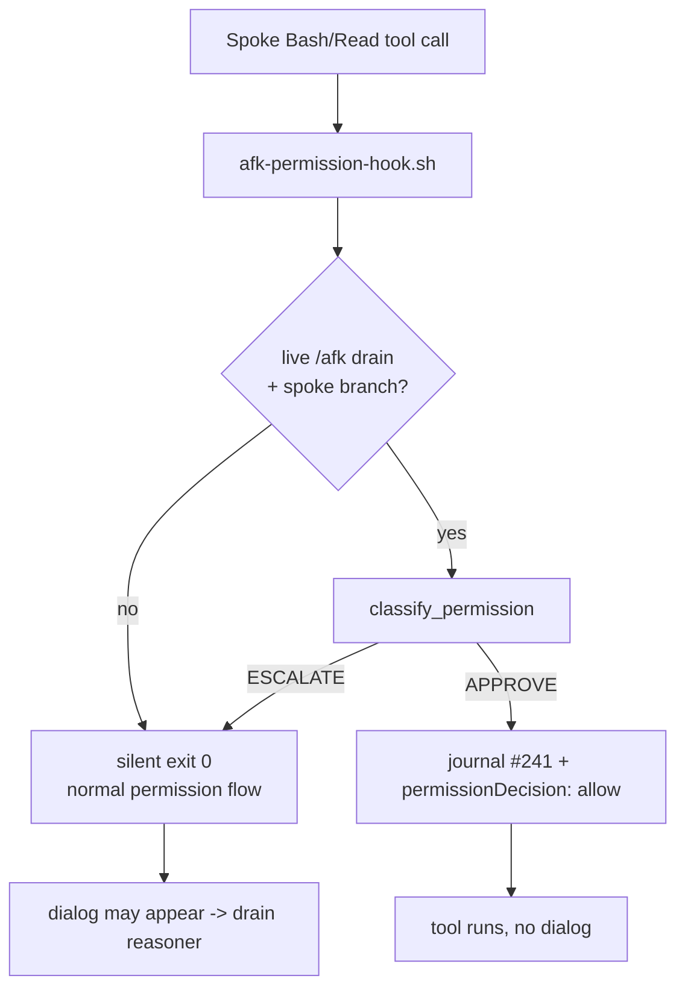

# AFK permission answering — the programmatic PreToolUse mechanism

The `/afk` drain used to answer a spoke's permission dialogs by **scraping the tmux
pane** and **typing keystrokes**. This document records why that mechanism was the shared
root cause of a whole bug family, and the design (issue #253) that replaces its common case
with a **programmatic decision at the PreToolUse hook layer** — so the benign case produces
no dialog at all and there is nothing to scrape.

## The problem: a scraper is inherently brittle

The pane path lives in `gate-broker.sh`:

- `_pane_shows_permission_prompt` greps `tmux capture-pane` for a prompt signature.
- `extract_pending_command` reads the gated command from the trailing **unresolved**
  `tool_use` in the transcript JSONL.
- `approve_permission` types `1` then a separate `Enter` into the pane.

Every fix in the 2026-07-11/12 run revealed the next, because the surface is a TUI dialog
detected and operated *after* it appears:

| Issue | Symptom |
|-------|---------|
| #240 | `extract_pending_command` read the wrong `tool_use` (resolved vs pending). |
| #246 | a permission park was misclassified as hung (reap ordering). |
| triage | `_permission_pending` missed a 3-option "Yes / Yes-don't-ask / No" dialog. |
| — | `send-keys -l` swallowed; QCM needs Enter-on-highlight; a second Enter races empty. |

The conclusion from that run: **the security layer keeps intervening because the mechanism
is the bug.** Move the decision off the pane.

## The decision: Option A (a spoke PreToolUse hook), A1 form

Run the decision **where the tool call is actually gated** — a PreToolUse hook — reusing
the exact allow/deny logic the drain already trusts (`classify_permission`). A benign
in-worktree op is auto-approved with **no dialog ever shown**; anything ambiguous **stays
silent** and falls through to the existing drain reasoner / pane path.

- **A1 (shipped here):** the hook auto-approves benign scoped self-ops and defers everything
  else. It eliminates the pane surface for the common case (incl. the #238
  `chmod +x x.sh && ./x.sh` smoke) while keeping the proven reasoner as the rare-case
  fallback.
- **A2 (deferred follow-up):** the hook itself invokes the reasoner and returns
  `permissionDecision:"deny"` with a redirect reason, fully retiring the pane. Deferred
  because it runs the headless reasoner synchronously inside a blocking hook — a latency and
  auth-surface change worth its own issue.

Options **B** (`--permission-mode` / a per-spoke static allowlist) and **C** (harden the
scraper) were rejected: B can't reuse `classify_permission`'s compound decomposition +
in-worktree mutation lane (it degrades to the coarse static rules that already fail on
compounds, #37/#45); C keeps the brittle scraper as the primary path.

## How it works



Two pieces, both in scope-synced `shared/`:

- **`shared/hooks/afk-permission-hook.sh`** — a thin PreToolUse shim. It locates
  `gate-broker.sh` (synced to `.claude/skills/hub/scripts/` in every spoke, resolved via
  `$CLAUDE_PROJECT_DIR`), sources it, and calls the decision function. Best-effort, always
  `exit 0` — a PreToolUse allow-only hook must never fail a session.
- **`gate-broker.sh :: afk_permission_hook_decide`** — the one source of truth. It reads the
  PreToolUse payload on stdin, rebuilds the classifier command string **exactly** as
  `extract_pending_command` does (Bash → its command; Read → `Read <file_path>`; any other
  tool → the tool name, so browser/computer/mcp escalate), gates on the spoke self-limit,
  runs `classify_permission`, and on `APPROVE` journals + prints the allow verdict.

### The self-limit: only inside a live drain

`_afk_supervisor_live` mirrors `afk-notify-wake.sh`'s gate — a running `.afk-heartbeat`
supervisor pid (`kill -0`) in the git-common-dir — and the branch slug must carry an issue
number. Either missing ⇒ the hook stays silent. This keeps **attended sessions and the hub
checkout untouched**: no dispatch-time change is needed, the hook self-limits at runtime.

## Evaluation findings

### Does a hook `allow` suppress the dialog? (the load-bearing question)

Yes for the spoke's gated commands — this is the **same mechanism `chmod-scope-guard.sh`
already relies on in production**, which is the repo's working evidence that a PreToolUse
`allow` bypasses the prompt a spoke would otherwise show.

> [!IMPORTANT]
> A hook `allow` bypasses the **default** permission prompt (a command that is simply not on
> the spoke's allow-list), **not** an explicit `ask`/`deny` **rule** in settings — per the
> Claude Code permissions docs, deny/ask *rules* are evaluated regardless of what a hook
> returns. The spoke seeds an **allow-list only** (`worktree-new.sh`) with no per-command
> `ask` rules, so its gated commands hit the default prompt and are suppressible. The one
> thing to confirm on the live drain is the manual #238 smoke below; if a deployed CC version
> ever stopped honoring hook-`allow` for the default prompt, `chmod-scope-guard` would break
> in lockstep and Option A/C would need revisiting together.

### Interaction with the existing scope-guard hooks (no double-gating / no bypass)

Confirmed against the Claude Code hooks semantics:

- **All matching PreToolUse hooks run in parallel; precedence is by decision type
  (`deny` > `ask` > `allow`), not by array order.** So a scope-guard's `deny` (or a `deny`
  *rule*) stays authoritative regardless of where `afk-permission-hook`'s group sits in the
  array. "Register it last" is therefore satisfied structurally — order does not change the
  outcome.
- **No bypass:** the hook's allow-set = `classify_permission` `APPROVE` ⊆ benign scoped
  self-op, a strict subset of what the scope-guards already permit. It **never denies**, so
  it can never override another guard, and it never allows anything a guard would deny
  (main-push, force-push, history rewrite, out-of-tree `rm` are all `ESCALATE` → silent).
- **No double-gating:** on `ESCALATE` the hook emits nothing, so `push-scope-guard` /
  `rm-scope-guard` / `chmod-scope-guard` and the pane path run unchanged.

### Auto-approvals still journal (#241)

Every hook auto-approve calls `_broker_journal_line "$issue" permission "hook auto-approved:
<cmd>" reversible` before printing the verdict — the same durable per-run journal
(`decision-journal.jsonl`) the drain uses — so a decision made with no dialog is auditable in
the morning review. It is file-only (no per-approve GitHub comment; that would be spam).

## Install path

`shared/hooks/metadata.yml` registers the hook (Claude-only, `preToolUse`, matcher
`Bash|Read`) → `sync-to-repo.sh` writes it into `.claude/settings.json` → `worktree-new.sh`
already `rsync`/`cp`'s the whole `.claude/` tree into every spoke. **No `worktree-new.sh`
change is required** — the hook propagates with the existing runtime-config copy and
self-limits via the heartbeat gate. (The issue's `Scope:` line lists
`shared/skills/hub/scripts/worktree-new.sh`; the file actually lives at
`scripts/worktree-new.sh`, and it needs no edit.)

## Deferred follow-ups

- **A2** — the hook reasons on `ESCALATE` and returns `deny`-with-reason, fully retiring the
  pane path (its own issue: synchronous reasoner in a blocking hook).
- **Performance** — the shim sources the full `gate-broker.sh` on every Bash/Read tool call
  in a spoke. Acceptable for the prototype; a follow-up could extract a minimal decision lib
  or add a cheap pre-source bail (no heartbeat ⇒ exit before sourcing).
- **Journal noise** — the hook fires on every Bash/Read call, including ones already on the
  spoke's allow-list that would never have prompted, so `decision-journal.jsonl` gets a
  `hook auto-approved` line for routine commands too. A PreToolUse hook can't see the resolved
  permission decision, so it can't tell "would have prompted" from "already allowed". A
  follow-up could dedupe by command signature or move routine approves to a quieter surface.

## Manual smoke (the #238 acceptance case)

```bash
# a spoke on an issue branch, a live heartbeat, the #238 compound → allow + journal, no dialog
HB=$(mktemp); printf '%s 0 wake1\n' "$$" > "$HB"
printf '{"tool_name":"Bash","tool_input":{"command":"chmod +x ./x.sh && ./x.sh"},"cwd":"%s"}' "$PWD" \
  | AFK_HEARTBEAT="$HB" AFK_STATE_DIR=$(mktemp -d) bash shared/hooks/afk-permission-hook.sh
# → {"hookSpecificOutput":{...,"permissionDecision":"allow",...},"permission":"allow"}
```

Unit coverage lives in `tests/unit/test_gate_broker.py`
(`test_afk_permission_hook_*`).
