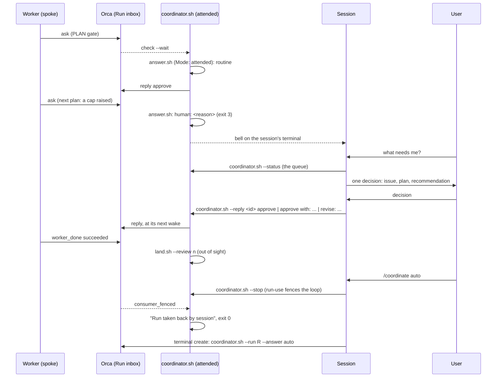

# ai-toolkit v2: architecture and runbook

ai-toolkit v2 is **policy plus a thin scripted lifecycle** for AI coding agents, running on top of [Orca](https://github.com/stablyai/orca).
Orca owns execution: worktrees, agent launch and prompts, agent state and liveness, the question/answer channel, completion signals, retries,
notifications and the UI. GitHub owns the backlog (issues, labels) and the test gate (CI). ai-toolkit keeps what is its own:

| Layer | What | Where |
|---|---|---|
| Policy | rules, skills, agents, prompts (Claude Code only, D4): the content agents read | `shared/` |
| Lifecycle glue | issue to worker (`dispatch.sh`), the Run loop (`coordinator.sh`), answer, review, land | `scripts/` |
| Guards | 3 Claude PreToolUse hooks + 2 native git hooks (deny-lists, D8) | `hooks/` |
| Telemetry | the launch shim exporting Claude's native OTel + a collector config (D1) | `bin/`, `langfuse/` |
| Config | flat `KEY=value` defaults, overridden per machine | `settings/ai-toolkit.env` |

There is no state directory of marker files, no supervisor self-copy, no tmux. State lives in Orca (orchestration DB, worktree metadata),
git, and GitHub labels. The only files ai-toolkit keeps are the human-reply spool, the `holder.<pid>` display file of a running coordinator (below) and the per-dispatch issue record (Known limits).

## Layout (repo root)

```text
scripts/   lib.sh dispatch.sh land.sh review.sh answer.sh coordinator.sh reply.sh setup.sh archive.sh sync.sh install.sh otel.sh cutover.sh
bin/claude-spoke           launcher: the project's guards (--settings .ai-toolkit/claude-settings.json), OTel env + spoke_run_id in a spoke, then exec claude (plain claude in an unsynced project)
hooks/claude/              push-guard.sh danger-guard.sh judge.sh secrets-scan.sh permission-relay.sh (synced to .ai-toolkit/hooks/claude/, registered by settings/claude/settings.json; judge.sh is danger-guard's second stage)
hooks/git/                 commit-msg (conventional type + #N anchor), pre-commit (no commit on the base branch in the main checkout)
langfuse/                  otelcol.yaml compose.yaml (collector only; dashboards and scores are a later batch)
settings/                  ai-toolkit.env (defaults) claude/settings.json (hook registrations)
shared/                    rules/ (always-on + on-demand/), skills/, agents/, prompts/: frontmatter lives in each file
e2e/                       spoke-scenario.sh (local scratch repo, stubbed gh), github-scenario.sh + switch-scenario.sh (real GitHub, shared github-lib.sh), cutover-rehearsal.sh
tests/                     pytest -n auto tests: PATH stubs for orca/gh/claude, tmp git repos, no real network
orca.yaml                  Orca hooks of THIS repo (setup/archive); a synced target gets a generated one
```

## Lifecycle of one issue

**Orchestration facts come from Orca** (the principle: Project Goal in `shared/rules/guidelines.md`). The coordinator sets the issue link at dispatch
(`worktree set --issue`), names the branch and worktree (`<n>-<slug>`), opens the Run and the dispatch, and answers the gates (`orchestration reply`).
`answer.sh`, `review.sh`, `land.sh` and the loop **must** read the issue link, branch, worktree path, Run, dispatch id and gate replies from Orca, and must not take them from
`task.md`, a branch name, an environment variable or a worker's message; when Orca does not answer they wait or hand the question to the human.
A script that still reads a worker-controlled source, or a worker that can still rewrite these facts through its own `orca` CLI, is an open bug, not design.

1. **Issue.** `gh issue create` with a footer: `Scope: <paths>` (disjointness is the parallelism contract), `Gate: plan` (default, the full cycle) or `none` (the light lane: no PLAN gate, no in-worker review; only the user sets it), optional
   `Model: <id> [effort]`; labels `priority`, `hold`, `blocked`. Blocked-by relations are GitHub's own.
2. **Pick.** `dispatch.sh --next`: open, not `hold`/`blocked`, all blockers closed, not already linked to a worktree of this repo, `Scope`
   disjoint from the in-flight ones (a missing or `*` scope is exclusive); `priority` first, then the lowest number. Exit 3 = nothing ready.
3. **Dispatch.** `dispatch.sh <n>`: `worktree create` (Orca runs `scripts/setup.sh` first: `.claude/` copied from the main checkout, `spoke-run-id`,
   `task.md` from the issue), a `claude-spoke` terminal (the two-step launch: Orca's own agent launch cannot carry the per-spoke OTel env), then `worker-start --terminal` with the seed prompt, then `worktree set --issue n
   --workspace-status in-progress`, then the record `dispatch/<dispatchId>` = `n` in the Run's coordinator spool. Branch = Orca's `<n>-<slug>`.
4. **Gate.** Full lane (`Gate: plan`): the worker explores, then blocks in its preamble's `orchestration ask` with the plan (options approve, revise; the reply is `approve`, `approve with: <change>` or `revise: <change>`, chosen per `afk-answering`, Choosing the reply).
   The coordinator answers it (`answer.sh`: always in auto, only a routine plan in attended) or leaves it open for the human (below). No edit happens before `approve`.
5. **Work.** Policy only inside the spoke: RED, GREEN, REFACTOR, in-spoke `code-review` (not in the light lane), `git push -u origin HEAD`. Hooks deny base-branch
   pushes, force pushes, `--no-verify`, and the destructive shapes of D8. Then `worker_done --outcome succeeded` (or `failed`).
6. **Review.** `review.sh <n>`: a fresh read-only Opus runs the `code-review` agent on `origin/<base>...<branch>`; its last message is one JSON
   verdict `{verdict, blockers, warnings, tdd_followed, tests_weakened, summary}`. `tests_weakened`, `tdd_followed: false` or any blocker beats an APPROVE.
7. **Gate on tests.** `land.sh`: CI must be green for the EXACT tip (`gh run list --commit <sha>`); if the base moved, merge it on the spoke, push,
   gate again. `LOCAL_GATE=1` runs `CHECK_CMD` in the spoke instead (repos without CI).
8. **Land.** fast-forward the main checkout to the gated tip, push, `gh issue close -c "landed in <sha>"`, delete the remote branch (lease-guarded),
   `worker-release` every dispatch, `worktree rm --run-hooks`. In the toolkit's own checkout the cleanup first re-runs `sync.sh` on it, so the toolkit's self-sync is automatic after a land;
   a running loop keeps its own `coordinator.sh` until it is restarted (sync replaces files by rename).
9. **Rounds.** A rejected review (max 2 rounds), red CI or a merge conflict (1 round) goes back to the worker as a fresh dispatch whose spec starts with
   `address:`. Still failing, a timeout, a `failed` completion or an escalation: label `blocked` + comment + the Orca surfaces (worktree comment, terminal bell), the worker is released,
   the **worktree is kept** for the human.
   `dispatch.sh --address` / `--retry-of` refresh the kept worktree's installed copies first (`setup.sh --refresh`, output to stderr): the synced `.claude/` set listed in main's `sync-manifest`
   is copied, what main's sync has dropped since is removed, and files outside that set (`settings.local.json`, locks, anything the worker made) are left alone.

## Two modes, one switch

One coordinator, the loop (`coordinator.sh`), holds the Run in its own Orca terminal in either mode and does the routine work (dispatch to the cap, land with the independent review, retry, block,
route leftovers). A Claude session never binds the Run, `check`s or reads the inbox. The modes differ in what the loop decides alone and how the user is reached. The switch is explicit, never inferred from presence:
`/coordinate attended` and `/coordinate auto [--until HH:MM] [--drain]` (alias `/afk`) each start their loop in an Orca terminal bound to the SAME Run after `coordinator.sh --stop --run <run>` took it back.

| | auto | attended |
|---|---|---|
| PLAN gate | `answer.sh` always answers (`Mode: auto`) | a routine plan is approved by `answer.sh` (`Mode: attended`); any other plan is its third outcome, `human: <reason>` (exit 3): left open on the Run, the worker waits |
| Permission request | `deny` at once, no model | never answered by the loop: left open for the user, who has the relay's 9 minutes (it denies itself after that) |
| What reaches the user | blocked issues, each flagged with the bell of the loop's terminal | the **queue**: open questions (oldest first), blocked issues without `hold`, in `--status`; one bell per NEW queued decision on the session's terminal (`--bell-tty`) |

The session in attended mode only presents the queue, one decision at a time, relays each answer with `coordinator.sh --reply`, writes into the issue any answer that changes what it asks, and shows no routine event.
Its other requests go through the loop too: `coordinator.sh --run R --dispatch <issue> ['<message>']` queues a request (a file in the reply spool's `requests/`, line 1 the message, line 2 the reason it cannot run yet) that the loop runs
ahead of its own pick with `dispatch.sh` (`--address` with a message, or a default one, for a kept worktree; a fresh worker reads only the issue body, so a message with no worktree is refused), within the cap; for a fresh issue `dispatch.sh --next <issue>` decides with its own ready rule (hold, blocked, open blocker, in flight, Scope overlap) and its refusal, with its exit code 3, is the reason; a request that cannot run (on hold, blocked with no message, already running, not ready for `dispatch.sh` (a Scope overlap among others), no free slot, an unreadable issue, a failed dispatch: not retried) stays
in `--status` with its reason until it runs or `--dispatch <n> --cancel` withdraws it (only a closed issue is dropped); a finished worker is landed by the loop itself.
The bell is `printf '\a'` appended to a terminal device: Orca has no verb to ring another terminal, so the skill passes its own tty (`--bell-tty`; anything that is not a terminal falls back to the loop's own) and Orca's
suppress-when-focused keeps it silent while the user works there. The ids last seen live in one shell variable (no file), so a decision rings once; a restart rings once more for the blocked issues still waiting and for the questions already open when the loop starts (they count as queued), and the blocked list is read again only after a sweep or when the loop itself blocked something. Otherwise a question counts only once this loop has left it open: one that arrived while the loop was busy
(a land takes minutes) may still be answered by it, a routine event. `--status` shows only the loop's own `blocked:` comment as the reason, one line without control bytes, since the repository may be public.



`run-use` from another terminal always succeeds: it takes the Run over (the consumer generation grows) and fences the previous holder, whose pending `check --wait`
returns `consumer_fenced` at once. So re-binding IS the stop mechanism: no signal, no stop file. The loop, on a fence (or when `run-show` names another holder at
the top of a tick, before each message, before the ack, before it would label an issue `blocked`), logs `Run <id> taken back by <handle>` and exits 0: it never
retries and never acks, the unfinished batch replays to the new holder (the new loop acks a replay for an issue already closed). `--stop` also waits (bounded) until
the loop has really exited, because a land may be in flight; exit 1 means it is still finishing a step. `--status` prints `held by: coordinator.sh (<mode>)`,
`held by: a session (<handle>)` or `held by: nobody`: the mode comes from `holder.<pid>` in the spool dir. That file is also what `--stop` waits on (never `run-show`, which already names the caller on a second `--stop`):
`--stop` returns 0 only when no live `coordinator.sh` (its pid's command must still say so) is bound as another handle. A replayed `worker_done` for a closed issue is acked as already landed.

## Permission relay

A worker's permission prompt would otherwise sit in its own terminal where nobody looks. `hooks/claude/permission-relay.sh` (a `PermissionRequest` hook, matcher `*`, registered in `settings/claude/settings.json`
with `timeout: 600`) puts every tool-permission dialog a worker would show to the Run and resolves it with the reply. Measured on claude 2.1.289: the event fires in bypass mode for each source (a `PreToolUse`
`ask` such as any of danger-guard's sensitive-operation asks, an `ask` permission rule, a prompt Claude Code raises itself such as the built-in dangerous-`rm` check, and a subagent's prompt), an `allow` or `deny` from it dismisses
the dialog, and it runs next to Orca's own global `PermissionRequest` hook without losing either decision. The payload carries `tool_name`, `tool_input`, `cwd` and `permission_mode` only: no reason and no `tool_use_id`,
so danger-guard records the reason of its ask under `.ai-toolkit/ask-reasons/<sha256 of tool+input>` (single use, 10 minutes) and the relay joins it, else prints `reason: unknown`. Not seen, because they are not
tool-permission dialogs: the folder-trust and bypass-mode startup dialogs (dispatch answers them) and MCP elicitation (not exercised). `AskUserQuestion` and `ExitPlanMode` are denied without asking (a hook `allow` does not resolve `ExitPlanMode`).

```mermaid
sequenceDiagram
    participant W as Worker (relay hook)
    participant O as Orca (Run inbox)
    participant L as coordinator.sh
    participant S as Session (attended)
    participant U as User
    W->>O: ask "PERMISSION REQUEST ..." (allow, deny)
    O-->>L: check --wait
    L->>L: auto: reply deny (never answer.sh)
    L-->>S: attended: left open, queued, one bell
    S->>U: tool, command or change, reason
    U->>S: decision
    S->>L: coordinator.sh --reply <id> allow | deny
    L->>O: reply allow | deny
    O-->>W: allow: the call runs; anything else: denied
```

The question's first line, `PERMISSION REQUEST (not a plan gate: ...)`, is what tells it from a PLAN gate. `coordinator.sh --answer auto` replies `deny` at once and never runs `answer.sh` (which refuses such a question too);
`--answer human` leaves it open like a gate and the human replies `allow` or `deny` with `--reply`; the coordinate skill shows it to the user and replies only with their decision. Issue comments name the tool and the
answer only, never the command or content. The relay is **fail-closed**: exactly `allow` lets the call through, and a missing handle, no Run, `orca` erroring, an unparsable payload or reply, no `jq` and a timeout all answer
`deny`. A hook that exceeds its own timeout is killed with no decision and the local dialog stays waiting, so the relay bounds its ask with its own timer (`--timeout-ms` 540000, kill at 570 s) under the hook timeout (600 s).
While it waits, the dialog is drawn in the worker too; the relay's answer dismisses it. Orca leaves a question pending after its ask times out, so a question the relay already denied stays open in the Run until replied: a late reply changes nothing (the coordinate skill ignores a stale one). Outside a worker (no `.ai-toolkit/spoke-run-id`) the hook prints nothing and the local prompt stays.

**The loop never approves a permission request (#450).** In attended mode every relayed request stays open and is queued for the user, who answers with `--reply <id> allow|deny` inside the relay's 9 minutes; in auto mode it is denied at once. There is no containment check in the loop and no second judge mode:
the guard and its judge (below) already allow a recursive delete of a literal path inside the worktree or below the temp root and clear a command that only mentions an operation, so few requests reach the queue.

## Coordinator runbook

```bash
orca terminal create --worktree path:<main-checkout> --title coordinator \
  --command "bash .ai-toolkit/scripts/coordinator.sh --answer auto --cap 1 --drain"      # in a synced target
```

One foreground process in an Orca terminal on the main checkout, the single consumer of one Run (`run-create`, or `--run R` to take it over from a session
or re-bind after a restart: everything else is re-derived from `worker-list`, `worktree list` and labels). Flags: `--answer auto|attended|human`, `--bell-tty <tty>` (attended: where the bell rings), `--cap N` (default `CONCURRENCY_CAP`),
`--until HH:MM`, `--drain` (stop when nothing is ready and no worker is live), `--status` (read-only: Run, who holds it, live workers, the queue in the order to present it with each reply line, dispatch requests),
`--run R --reply <message-id> <answer>` and `--run R --dispatch <issue> ['<message>']` (queue a human answer or a dispatch request for the loop),
`--run R --stop` (take the Run from this terminal and wait for the loop to exit).

- **Human answers (`--answer human`, or when `answer.sh` has no usable answer).** The loop never pauses. It prints the question (wrapped, at most 25 lines) above the exact
  reply line in the coordinator terminal (and in `--status`), comments on the issue, sets the spoke worktree's Orca comment to `GATE waiting: ... | reply: ...`, rings the bell
  of its terminal. Notifications are Orca's, the project raises none itself: Orca turns that bell into its own notification when Settings > Notifications > Terminal Bell is on (off by default;
  the notification says only "Bell in <worktree>", never the event: the worktree comment, the issue comment and this log carry the text). A `blocked` issue and an auto-answer `WARN:` flag the same way. Run the reply line from ANY terminal (a bare `orca orchestration reply` is refused outside the Run's bound terminal):
  `bash .ai-toolkit/scripts/coordinator.sh --run <run-id> --reply <message-id> approve` or `... 'approve with: <small change>'` or `... 'revise: <what to change>'`; a permission question takes `allow` or `deny` instead.
  It queues one file in `~/.ai-toolkit/coordinator/<run-id>/replies/` (`AITK_STATE_DIR` relocates it); the loop sends it at its next wake (30 s while a question waits).
- **The queue (`--answer attended`).** Open questions (a plan handed over with its reason, a permission request) and open `blocked` issues without `hold`; the loop rings once for each new one. Answer with `--reply`; a blocked issue by a
  comment and removing the label, `--dispatch <n> '<message>'`, `hold` or closing it.
- **`blocked` issue.** Read the comment, then fix by hand in the kept worktree (`orca worktree show --worktree issue:<n>`), push, and `land.sh <n>`; or remove the label
  after fixing the cause and `dispatch.sh <n>` again; or `orca worktree rm --worktree issue:<n> --force --run-hooks`.
- **`land.sh` exit codes.** 0 landed, 2 refused (precondition), 3 review no, 4 gate red/timeout, 5 merge conflict, 6 landed but cleanup incomplete (main is pushed:
  finish with `land.sh --cleanup-only <n>`, never land again; it also covers a failed refresh of the toolkit's installed copies: run `scripts/sync.sh .` in the main checkout).
- **Restart / stop.** `coordinator.sh --stop --run <run-id>` from any Orca terminal (or `/coordinate attended` or `/coordinate auto`), or Ctrl-C in its terminal; start again with `--run <run-id>` (it takes the Run over).
- **Dispatch failure.** `dispatch.sh` can leave a half-made worktree: the coordinator removes it and labels the issue `blocked`.

## Setup on a new machine

1. Prerequisites: Orca >= `ORCA_MIN_VERSION` (`orca status` ready), `claude`, `gh` (logged in: spokes use that login, D9), `git`, `jq`, `python3`, `uuidgen`; `docker` only for the
   collector. `jq` is a hard requirement: without it the Claude hooks fail closed and deny every tool call.
2. `~/.zshrc` must skip tmux autostart in Orca terminals (`TERM_PROGRAM=Orca`), or Orca cannot see agents; `install.sh` warns.
3. In the target repo: `<toolkit>/scripts/sync.sh <repo>` (the one command, from the toolkit's main checkout, to install and to update), then `<toolkit>/scripts/install.sh <repo>` (repo-local `core.hooksPath`, never global), then `orca repo add --path <repo>` (once,
   never remove it: a removed repo leaves a stale card). The rules and the guidelines land in `.claude/rules/ai-toolkit/` (Claude Code loads subfolders), the project's own `CLAUDE.md` is never read, written or backed up, and what the sync wrote under `.claude/` plus `.ai-toolkit/` stays untracked through `.git/info/exclude` (a `.claude/` file the project tracks is left alone). `orca.yaml` is the one tracked file, because Orca reads the tracked one: the sync commits it alone (a fixed `chore(ai-toolkit)` message, nothing else in the host's index or tree is touched) and pushes it to `BASE_BRANCH` when it changed; a run that changes nothing makes no commit and no push, and a push the remote refuses (protected branch, no network) keeps the commit, says what to do and exits 0, the next run pushing it. It refuses, before writing anything, when the host is not on its base branch, is behind or has diverged from `origin/<base>` (never pulls, rebases or forces), has an `orca.yaml` edit the sync did not write, or when the target or the toolkit copy being run is a linked worktree (git's own `--git-dir` vs `--git-common-dir`; a push inside a script is invisible to `push-guard.sh`, so a worker must not reach the base branch through it). It never pushes someone else's waiting commits. `--no-commit` writes and stops; `--local-only` writes `orca.yaml`, excludes it and never commits it (then commit a tiny `orca.yaml` yourself); the toolkit's own checkout never commits. **The guards** (danger, push, secrets, permission relay) are registered in `.ai-toolkit/claude-settings.json` with `disableAllHooks: false`, never in the project's `.claude/settings.json`, and `bin/claude-spoke` passes that file with `--settings` (measured on claude 2.1.291: it runs together with the project's and the user's hooks, in bypass mode too, and outranks a project `settings.local.json` that sets `disableAllHooks: true`). The hook scripts live in `.ai-toolkit/hooks/claude/` and a worker runs the main checkout's copy (`AI_TOOLKIT_DIR`), not one in its worktree. The launcher takes the settings of the project the session starts in, so Orca's one Claude command (`install.sh` prints it) serves every project: an unsynced one gets plain claude, a worker without the file is refused. **A session not started through the launcher has no guards**, and neither has a `claude` a worker starts itself (the project's settings no longer carry them); `/coordinate` checks its own session and says so. A worker's writes under `$AI_TOOLKIT_DIR` (the whole main `.ai-toolkit/`: guards, launcher, scripts, env files) ask or are denied in every spelling the pattern list can see, and each hook command ends in `|| exit 2` so a missing script or variable denies instead of letting the call through. Residual, all of a worker that is already running unprompted: a nested `claude` it starts itself has no guards (nor do the coordinator's own headless calls: answer, review, judge, triage, which run with restricted tools); a write through a shell glob or brace expansion of the directory name, a hard or leaf symlink, a loop that never names the path after a write verb, the macOS `/System/Volumes/Data` alias of a path, or a rewrite of its own worktree's `.git` pointer (which picks the settings file of its next launch) is not seen by the pattern list; a hook killed on its timeout lets the call through; a `sync.sh` run is seen when it is spelled as a direct run (`bash`, `./`, a `VAR=` prefix, `bash -x`, `time`), not behind `bash -c`, `xargs`, `exec` or a wrapper the worker writes and runs, so the commit-and-push of `orca.yaml` (which only ever publishes the sync's own `orca.yaml`: its subject, orca.yaml alone in the net change against the base) is the part that holds when the guard does not. The launcher refuses a settings file that does not register the guards (`disableAllHooks` false and PreToolUse hooks). The precedence the scheme relies on was measured on claude 2.1.291; repeat the proof (a hostile `settings.local.json` with `disableAllHooks: true` must not switch the guards off) on a Claude Code bump. **The separation rule:** every file the toolkit puts in a project is either inside a directory dedicated to the toolkit (`.ai-toolkit/`, `.claude/rules/ai-toolkit/`) or carries a name that says it is the toolkit's; nothing of the toolkit sits unmarked among the project's own files (skills, agents and commands are the exception Claude Code forces: it fixes their location, and their names are what the user types). A host synced the old way is cleaned up from its manifest: the flat rule files and the generated root `CLAUDE.md` go, a `CLAUDE.md.bak` is restored, tracked leftovers are reported, never removed.
4. Per-machine settings go in `<repo>/.ai-toolkit/ai-toolkit.local.env` (gitignored): `CHECK_CMD`, `BASE_BRANCH`, `LOCAL_GATE=1` if the repo has no CI, `CONCURRENCY_CAP`,
   model ids, `LANGFUSE_*`. Precedence: caller env > local env > `.ai-toolkit/ai-toolkit.env`. CI must run on **every branch push** (`land.sh` waits for the run of the exact tip).
5. The first Claude start in a new repo root shows the workspace-trust dialog (default "No, exit"): `dispatch.sh` answers it (Down+Enter); a human can pre-trust the root.
6. The toolkit repo itself: `scripts/sync.sh .` generates `.claude/` (the rules and `guidelines.md` under `rules/ai-toolkit/`; no root `CLAUDE.md`) and `.ai-toolkit/`; it never overwrites the tracked `orca.yaml`.
7. Optional telemetry (D1): `scripts/otel.sh up` (Langfuse keys in the local env) starts the collector; spokes launched by `dispatch.sh` already export to it.

## Testing

`pytest -n auto tests` (stubs for `orca`/`gh`/`claude`, a tmp repo + bare origin per test, env stripped, no wall-clock asserts). `shellcheck` over scripts, hooks, shim and e2e.
Real checks: `e2e/github-scenario.sh` (real GitHub repo, real CI, real Claude; `E2E_PHASES`, `E2E_ANSWER=human`, `E2E_HUMAN_WAIT=1`), `e2e/switch-scenario.sh` (a stand-in session holds the Run, replies to a gate, hands over to `--answer auto`, takes the Run back with `--stop`) and `e2e/spoke-scenario.sh` (local, stubbed gh).
CI (`.github/workflows/ci.yml`): tests, shellcheck, sync-twice-no-drift, macOS + Linux.

## Known limits (D8, D9)

`danger-guard.sh` follows one rule: everything is authorized except sensitive operations, which ask the user when someone can answer and are denied when no one can.
What **asks** (exit 0, `permissionDecision: "ask"`, shown even under `--dangerously-skip-permissions`, in the file-tool and Bash lanes alike): writes to `orca.yaml`, `~/.claude/settings.json` and `.github/workflows/`, and in a spoke the project `.claude/settings*.json`, `.claude/hooks/`, `.ai-toolkit/spoke-run-id` and anything under the launcher's `$AI_TOOLKIT_DIR` (the main checkout's `.ai-toolkit/`: guards, launcher, scripts, env files) in every spelling the pattern list sees, running `sync.sh` and naming `AI_TOOLKIT_ALLOW_BASE_COMMIT` (the sync commits and pushes the base branch inside the script, where `push-guard.sh` cannot see, and the script cannot tell a worker from a human: only the worker's tool call can be seen); `rm -r` outside the worktree, of its root or home, of another git checkout or worktree, or with an unexpanded variable; `git reset --hard` in the main checkout (or with `--git-dir`/`--work-tree`, where the guard cannot tell the target); `git clean -x` and `git stash -a`. A call asks once: the reason names every sensitive segment of a compound command.
Someone can answer when there is no spoke marker (the user's own prompt) or when the permission relay is installed (`$AI_TOOLKIT_DIR/hooks/claude/permission-relay.sh` present and registered in `$AI_TOOLKIT_DIR/claude-settings.json`; the launcher exports `AI_TOOLKIT_DIR`, so a worker session not started through it has no relay): the relay puts the ask to the Run, so an attended session shows it to the user and the auto loop denies it. Otherwise the call is **denied** (exit 2) with the same message, since a local ask nobody sees would hang; a headless `claude -p` session also denies an ask, measured in default and bypass mode. Deciding attended or not does not read Orca (no holder terminal title heuristic).
What **still denies**, asked never: `AskUserQuestion` in a spoke (not a permission: the worker has the Run's ask), a worker's write to the human's reply spool `~/.ai-toolkit/coordinator/` (an approved write would let a worker forge the human's reply), and an unparsable tool payload (bad JSON, no `jq`: fail-closed).
**The judge (#405).** The regex sees text, so it also fires on a command that only *mentions* a sensitive operation (a commit message, a plan passed to the orchestration ask, a search pattern, an interpreter heredoc editing a test whose fixtures name a protected path). When it flags a Bash command, before any ask exists, `danger-guard.sh` pipes the command to `judge.sh`, a headless `claude -p` call (Sonnet 5.5, no tools, no settings so no hooks, the command on stdin). Only the exact reply `VERDICT: DATA` clears it, in every mode: the flagged text is data, and everything the command writes or deletes stays inside the worktree or this session's own scratchpad (`/private/tmp/claude-<uid>/<project>/<session id>/scratchpad`). Then it runs with no prompt, and one line (epoch, tool, the guard's reason, the judge's why) goes to `~/.ai-toolkit/judge-cleared.log`; no command text goes to GitHub, and the command reaches the model API (and a worker's OTel export, like any other tool content). `EXECUTES`, `UNSURE`, a malformed reply, a timeout (`DANGER_JUDGE_KILL_S`, 20 s), an error, a missing login or an unwritable log all end as today's decision (ask, relay or deny); an outage never denies or allows by itself. A command the regex does not flag, a file-tool hit and the hard denies never reach the judge. Median added to a flagged command: about 4 s. **A judgement, not a proof**: the model reads text the judged agent wrote and can be argued with; the user accepted that residual risk (no parser underneath). Like `orca` for the relay, `claude` is resolved from the hook's `PATH`. **Still a false positive:** `push-guard.sh` is unchanged and still hard-denies text that only quotes a push to the base branch.
Known limits: a brake, not a sandbox (for the guards' own files, see "The guards" in Setup); an approved ask is as trustworthy as the relay (the exit-2 floor under these operations is gone, so a planted `orca` that prints `allow` now reaches all of them, not only workflow writes), and a worker that removes its own marker through indirection is treated as the user's session (marker absence means attended); the relay answers the Run's question with the user's word, so a user who says `allow` takes the risk, and it shows the reason cut to 300 characters on one line (the full change is in the question). Residual limits of the relay, all of a worker that can already write outside its worktree: it resolves `orca` from the hook's `PATH` (as danger-guard does), so a planted `orca` ahead of the real one that prints `allow` would be believed, and a worker that could plant a leaf symlink to a protected path is not caught by `canon()` (pre-existing); the `reason:` line comes from a file in the worktree and is unverified. Control bytes are stripped from a permission question before anyone reads it, and a cut view says so.

**The dispatch record (#429).** The issue link is Orca state a worker terminal can rewrite (`orca worktree set --issue`), and every coordinator decision keys on it. So `dispatch.sh` also writes `dispatch/<dispatchId>` (the issue it gave that dispatch, mode 0600) in the Run's coordinator spool directory (the one `AITK_STATE_DIR` relocates), outside every worktree, and `ctx()` checks the link against it before any gate is answered or any land runs. A link that no longer matches blocks the **recorded** issue, with both numbers in the message, and releases the worker. So does a second worktree linked to the same issue (`review.sh` and `land.sh` pick the worktree by that link). A dispatch with no record **fails closed**: nothing is answered or landed for it, a gate question is flagged to the human with its reply command, a permission request is still denied, a `worker_done` is only logged, and the worker keeps its slot (it is skipped by the sweep, so `--drain` waits on it); no issue is blocked, since the link is the one thing not trusted. Dispatches already in flight when this lands have no record: let them finish (`--drain`) before the new coordinator starts, or answer them by hand.
Known limits of that check: a second layer, **not a sandbox**. The record is a file owned by the same user, so a worker that can already write outside its worktree by indirection (a script or `python -c`, a variable-held or wrapped `orca` the guard does not see, a direct request to Orca's local endpoint with the `ORCA_AGENT_HOOK_ENDPOINT` / `ORCA_AGENT_HOOK_TOKEN` every worker terminal holds) can forge the link and the record together. The dispatch id in a message payload is trusted once Orca has a worker row for it, so a worker that can send a message under another worker's dispatch id is not caught either (the same upstream scoping covers it). A relink between `ctx()` and `answer.sh`'s own read of the link is also not closed. The real fix lives in Orca, not here, and is an **upstream request**: refuse `worktree set`, `run-use` and a `check` of another terminal's mailbox from a worker handle, and scope the agent-hook token to the worker's own terminal and Run.

Spokes run with `--dangerously-skip-permissions` (Orca's default). The hooks are a **deny-list over command text, not a sandbox**: indirection (`eval`, variables, base64, a script written and run
later, git aliases), `cd` then relative paths, writes through MCP tools and secret reads are not caught. Spokes use the user's own `gh` login with its full scopes. Something stronger
(Claude Code's native sandbox, Orca VM/container environments, repo-scoped tokens) is required before using this on more sensitive projects.
Also: `issue:<n>` worktree selectors are global across the repos registered in Orca (two repos with a linked issue of the same number collide); the review verdict is one model's opinion;
Langfuse scores, dashboards and any step-level attribution are designed after cutover from concrete analysis questions (D1); the Cursor/Copilot outputs are gone (D4).
