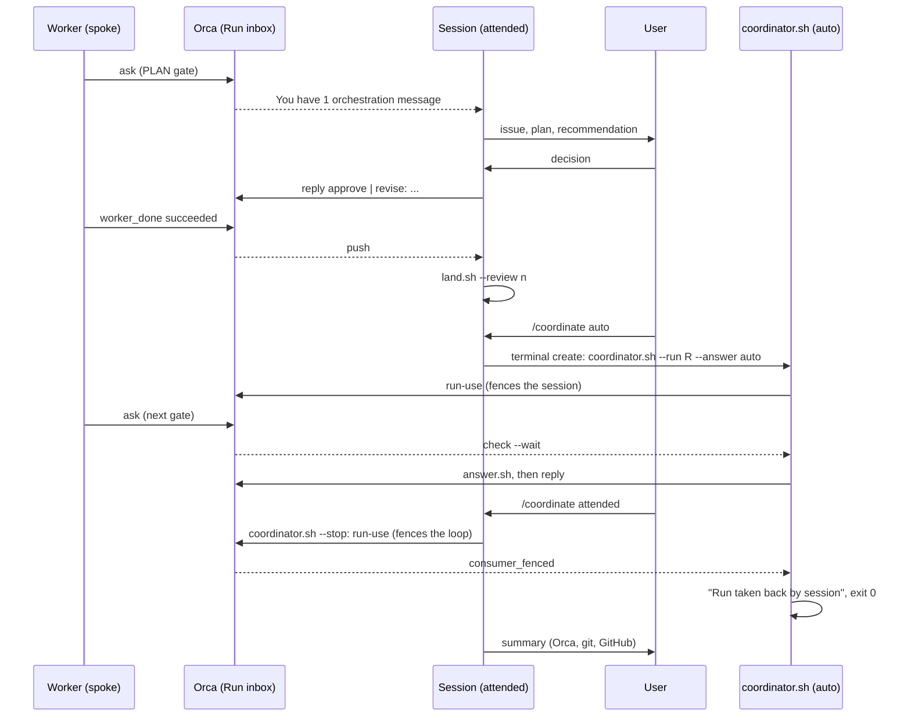

# ai-toolkit v2: architecture and runbook

ai-toolkit v2 is **policy plus a thin scripted lifecycle** for AI coding agents, running on top of [Orca](https://github.com/stablyai/orca).
Orca owns execution: worktrees, agent launch and prompts, agent state and liveness, the question/answer channel, completion signals, retries,
notifications and the UI. GitHub owns the backlog (issues, labels) and the test gate (CI). ai-toolkit keeps what is its own:

| Layer | What | Where |
|---|---|---|
| Policy | rules, skills, agents, prompts (Claude Code only, D4): the content agents read | `shared/` |
| Lifecycle glue | issue to worker (`dispatch.sh`), the Run loop (`coordinator.sh`), answer, review, land | `scripts/` |
| Guards | 3 Claude PreToolUse hooks + 2 native git hooks (deny-lists, D8) | `hooks/` |
| Telemetry | the launch shim exporting Claude's native OTel + a collector config (D1) | `bin/`, `langfuse/` |
| Config | flat `KEY=value` defaults, overridden per machine | `settings/ai-toolkit.env` |

There is no state directory of marker files, no supervisor self-copy, no tmux. State lives in Orca (orchestration DB, worktree metadata),
git, and GitHub labels. The only files ai-toolkit keeps are the human-reply spool and the `holder.<pid>` display file of a running coordinator (below).

## Layout (repo root)

```text
scripts/   lib.sh dispatch.sh land.sh review.sh answer.sh coordinator.sh reply.sh setup.sh archive.sh sync.sh install.sh otel.sh cutover.sh
bin/claude-spoke           launch shim: OTel env + spoke_run_id resource attribute, then exec claude (pass-through outside a spoke)
hooks/claude/              push-guard.sh danger-guard.sh secrets-scan.sh (registered by settings/claude/settings.json)
hooks/git/                 commit-msg (conventional type + #N anchor), pre-commit (no commit on the base branch in the main checkout)
langfuse/                  otelcol.yaml compose.yaml (collector only; dashboards and scores are a later batch)
settings/                  ai-toolkit.env (defaults) claude/settings.json (hook registrations)
shared/                    rules/ (always-on + on-demand/), skills/, agents/, prompts/: frontmatter lives in each file
e2e/                       spoke-scenario.sh (local scratch repo, stubbed gh), github-scenario.sh + switch-scenario.sh (real GitHub, shared github-lib.sh), cutover-rehearsal.sh
tests/                     pytest -n auto tests: PATH stubs for orca/gh/claude, tmp git repos, no real network
orca.yaml                  Orca hooks of THIS repo (setup/archive); a synced target gets a generated one
```

## Lifecycle of one issue

1. **Issue.** `gh issue create` with a footer: `Scope: <paths>` (disjointness is the parallelism contract), `Gate: plan|none`, optional
   `Model: <id> [effort]`; labels `priority`, `hold`, `blocked`. Blocked-by relations are GitHub's own.
2. **Pick.** `dispatch.sh --next`: open, not `hold`/`blocked`, all blockers closed, not already linked to a worktree of this repo, `Scope`
   disjoint from the in-flight ones (a missing or `*` scope is exclusive); `priority` first, then the lowest number. Exit 3 = nothing ready.
3. **Dispatch.** `dispatch.sh <n>`: `worktree create` (Orca runs `scripts/setup.sh` first: `.claude/` copied from the main checkout, `spoke-run-id`,
   `task.md` from the issue), a `claude-spoke` terminal (the two-step launch: Orca's own agent launch cannot carry the per-spoke OTel env), then `worker-start --terminal` with the seed prompt, then `worktree set --issue n
   --workspace-status in-progress`. Branch = Orca's `<n>-<slug>`.
4. **Gate.** `Gate: plan`: the worker explores, then blocks in its preamble's `orchestration ask` with the plan (options approve, revise).
   The coordinator answers it (`answer.sh`, auto) or hands it to the human (below). No edit happens before `approve`.
5. **Work.** Policy only inside the spoke: RED, GREEN, REFACTOR, in-spoke `code-review`, `git push -u origin HEAD`. Hooks deny base-branch
   pushes, force pushes, `--no-verify`, and the destructive shapes of D8. Then `worker_done --outcome succeeded` (or `failed`).
6. **Review.** `review.sh <n>`: a fresh read-only Opus runs the `code-review` agent on `origin/<base>...<branch>`; its last message is one JSON
   verdict `{verdict, blockers, warnings, tdd_followed, tests_weakened, summary}`. `tests_weakened`, `tdd_followed: false` or any blocker beats an APPROVE.
7. **Gate on tests.** `land.sh`: CI must be green for the EXACT tip (`gh run list --commit <sha>`); if the base moved, merge it on the spoke, push,
   gate again. `LOCAL_GATE=1` runs `CHECK_CMD` in the spoke instead (repos without CI).
8. **Land.** fast-forward the main checkout to the gated tip, push, `gh issue close -c "landed in <sha>"`, delete the remote branch (lease-guarded),
   `worker-release` every dispatch, `worktree rm --run-hooks`.
9. **Rounds.** A rejected review (max 2 rounds), red CI or a merge conflict (1 round) goes back to the worker as a fresh dispatch whose spec starts with
   `address:`. Still failing, a timeout, a `failed` completion or an escalation: label `blocked` + comment + desktop notification, the worker is released,
   the **worktree is kept** for the human.

## Two modes, one switch

A Run has one consumer at a time. **Attended**: a Claude Code session on the main checkout (the `coordinate` skill) holds the Run; Orca pushes
`You have N orchestration messages` into it, the user discusses a worker's plan with the session, decides, and the session replies to the waiting
worker (`approve` or `revise: ...`), lands finished work with `land.sh --review`, and dispatches on request. **Auto**: `coordinator.sh --answer auto`
holds the Run (the loop below). The switch is explicit, never inferred from presence: `/coordinate auto [--until HH:MM] [--drain]` (alias `/afk`) starts the loop
in an Orca terminal bound to the SAME Run; `/coordinate attended` runs `coordinator.sh --stop --run <run>` and summarizes what happened while away from Orca,
git and GitHub. Mechanics stay in the scripts; the session only converses, decides and calls them.



`run-use` from another terminal always succeeds: it takes the Run over (the consumer generation grows) and fences the previous holder, whose pending `check --wait`
returns `consumer_fenced` at once. So re-binding IS the stop mechanism: no signal, no stop file. The loop, on a fence (or when `run-show` names another holder at
the top of a tick, before each message, before the ack, before it would label an issue `blocked`), logs `Run <id> taken back by <handle>` and exits 0: it never
retries and never acks, the unfinished batch replays to the new holder (the session ignores a replay for an issue already closed). `--stop` also waits (bounded) until
the loop has really exited, because a land may be in flight; exit 1 means it is still finishing a step. `--status` prints `held by: coordinator.sh (<mode>)`,
`held by: a session (<handle>)` or `held by: nobody`: the mode comes from `holder.<pid>` in the spool dir (display only, a dead pid or another handle is ignored).

## Coordinator runbook

```bash
orca terminal create --worktree path:<main-checkout> --title coordinator \
  --command "bash .ai-toolkit/scripts/coordinator.sh --answer auto --cap 1 --drain"      # in a synced target
```

One foreground process in an Orca terminal on the main checkout, the single consumer of one Run (`run-create`, or `--run R` to take it over from a session
or re-bind after a restart: everything else is re-derived from `worker-list`, `worktree list` and labels). Flags: `--answer auto|human`, `--cap N` (default `CONCURRENCY_CAP`),
`--until HH:MM`, `--drain` (stop when nothing is ready and no worker is live), `--status` (read-only: Run, who holds it, live workers, unanswered questions with their reply line),
`--run R --stop` (take the Run from this terminal and wait for the loop to exit).

- **Human answers (`--answer human`, or when `answer.sh` has no usable answer).** The loop never pauses. It prints the question (wrapped, at most 25 lines) above the exact
  reply line in the coordinator terminal (and in `--status`), comments on the issue, sets the spoke worktree's Orca comment to `GATE waiting: ... | reply: ...`, rings the bell
  of its terminal (Orca's `terminalBell` notification) and sends a best-effort desktop notification (osascript, warned when it fails; macOS may drop it silently). Run the reply line from ANY terminal (a bare `orca orchestration reply` is refused outside the Run's bound terminal):
  `bash .ai-toolkit/scripts/coordinator.sh --run <run-id> --reply <message-id> approve` or `... 'revise: <what to change>'`.
  It queues one file in `~/.ai-toolkit/coordinator/<run-id>/replies/` (`AITK_STATE_DIR` relocates it); the loop sends it at its next wake (30 s while a question waits).
- **`blocked` issue.** Read the comment, then fix by hand in the kept worktree (`orca worktree show --worktree issue:<n>`), push, and `land.sh <n>`; or remove the label
  after fixing the cause and `dispatch.sh <n>` again; or `orca worktree rm --worktree issue:<n> --force --run-hooks`.
- **`land.sh` exit codes.** 0 landed, 2 refused (precondition), 3 review no, 4 gate red/timeout, 5 merge conflict, 6 landed but cleanup incomplete (main is pushed:
  finish with `land.sh --cleanup-only <n>`, never land again).
- **Restart / stop.** `coordinator.sh --stop --run <run-id>` from any Orca terminal (or `/coordinate attended`), or Ctrl-C in its terminal; start again with `--run <run-id>` (it takes the Run over).
- **Dispatch failure.** `dispatch.sh` can leave a half-made worktree: the coordinator removes it and labels the issue `blocked`.

## Setup on a new machine

1. Prerequisites: Orca >= `ORCA_MIN_VERSION` (`orca status` ready), `claude`, `gh` (logged in: spokes use that login, D9), `git`, `jq`, `python3`, `uuidgen`; `docker` only for the
   collector. `jq` is a hard requirement: without it the Claude hooks fail closed and deny every tool call.
2. `~/.zshrc` must skip tmux autostart in Orca terminals (`TERM_PROGRAM=Orca`), or Orca cannot see agents; `install.sh` warns.
3. In the target repo: `<toolkit>/scripts/sync.sh <repo> [--local-only]`, then `<toolkit>/scripts/install.sh <repo>` (repo-local `core.hooksPath`, never global), then `orca repo add --path <repo>` (once,
   never remove it: a removed repo leaves a stale card). `--local-only` keeps every synced file untracked (`.claude/ CLAUDE.md orca.yaml`); then commit a tiny `orca.yaml` yourself, because Orca reads the tracked one.
4. Per-machine settings go in `<repo>/.ai-toolkit/ai-toolkit.local.env` (gitignored): `CHECK_CMD`, `BASE_BRANCH`, `LOCAL_GATE=1` if the repo has no CI, `CONCURRENCY_CAP`,
   model ids, `LANGFUSE_*`. Precedence: caller env > local env > `.ai-toolkit/ai-toolkit.env`. CI must run on **every branch push** (`land.sh` waits for the run of the exact tip).
5. The first Claude start in a new repo root shows the workspace-trust dialog (default "No, exit"): `dispatch.sh` answers it (Down+Enter); a human can pre-trust the root.
6. The toolkit repo itself: `scripts/sync.sh .` generates `CLAUDE.md` (from `shared/rules/guidelines.md`, gitignored), `.claude/` and `.ai-toolkit/`; it never overwrites the tracked `orca.yaml`.
7. Optional telemetry (D1): `scripts/otel.sh up` (Langfuse keys in the local env) starts the collector; spokes launched by `dispatch.sh` already export to it.

## Testing

`pytest -n auto tests` (stubs for `orca`/`gh`/`claude`, a tmp repo + bare origin per test, env stripped, no wall-clock asserts). `shellcheck` over scripts, hooks, shim and e2e.
Real checks: `e2e/github-scenario.sh` (real GitHub repo, real CI, real Claude; `E2E_PHASES`, `E2E_ANSWER=human`, `E2E_HUMAN_WAIT=1`), `e2e/switch-scenario.sh` (a stand-in session holds the Run, replies to a gate, hands over to `--answer auto`, takes the Run back with `--stop`) and `e2e/spoke-scenario.sh` (local, stubbed gh).
CI (`.github/workflows/ci.yml`): tests, shellcheck, sync-twice-no-drift, macOS + Linux.

## Known limits (D8, D9)

Spokes run with `--dangerously-skip-permissions` (Orca's default). The hooks are a **deny-list over command text, not a sandbox**: indirection (`eval`, variables, base64, a script written and run
later, git aliases), `cd` then relative paths, writes through MCP tools and secret reads are not caught. Spokes use the user's own `gh` login with its full scopes. Something stronger
(Claude Code's native sandbox, Orca VM/container environments, repo-scoped tokens) is required before using this on more sensitive projects.
Also: `issue:<n>` worktree selectors are global across the repos registered in Orca (two repos with a linked issue of the same number collide); the review verdict is one model's opinion;
Langfuse scores, dashboards and any step-level attribution are designed after cutover from concrete analysis questions (D1); the Cursor/Copilot outputs are gone (D4).
