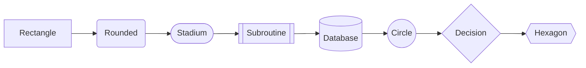
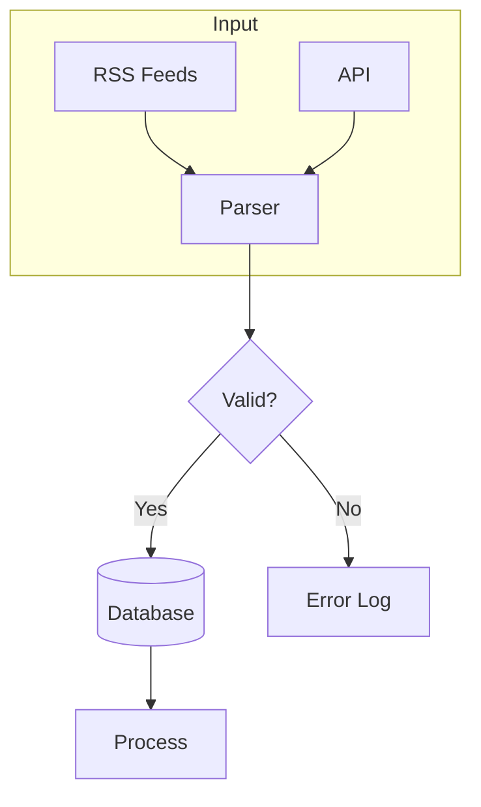
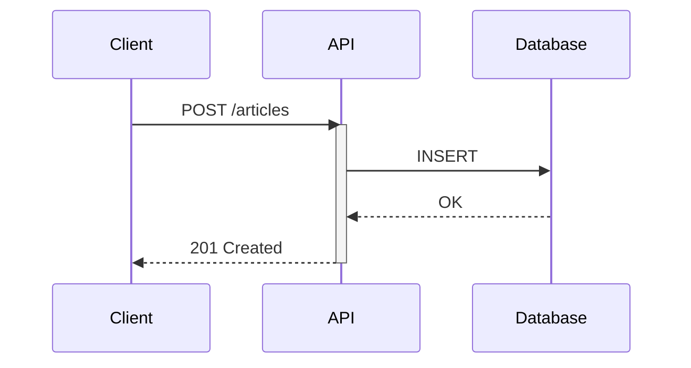
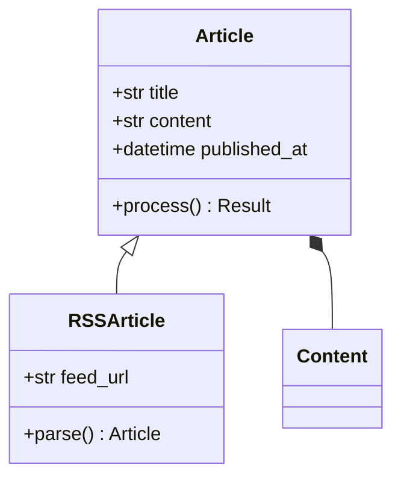
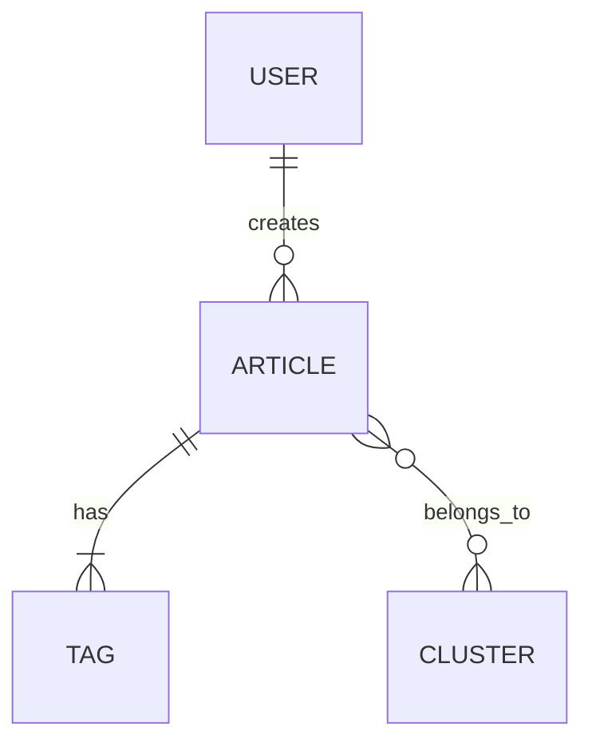
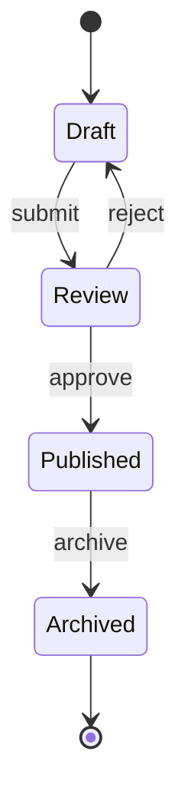
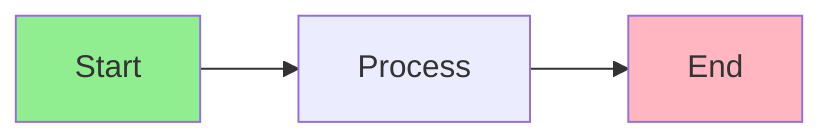
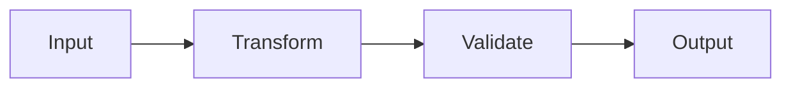
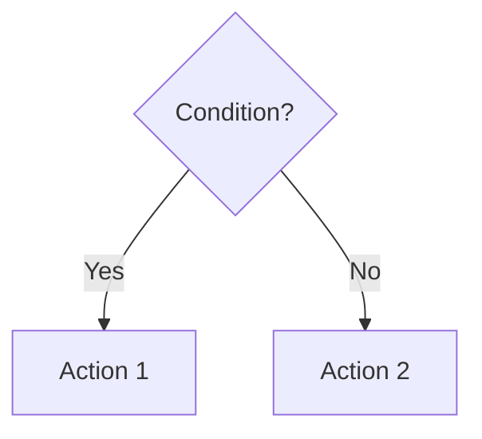
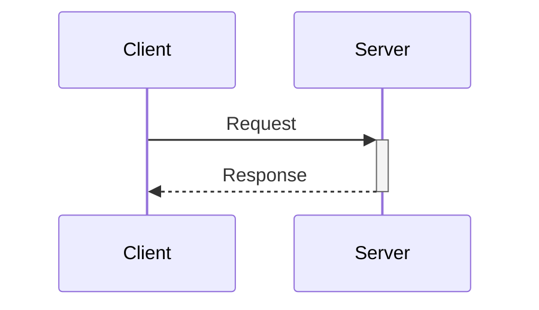

# Mermaid Conventions

## Diagram Type Selection

| Use Case | Diagram Type |
|----------|--------------|
| Process flows, workflows | `flowchart` |
| API calls, interactions | `sequenceDiagram` |
| Data models, OOP | `classDiagram` |
| Database schema | `erDiagram` |
| Project timelines | `gantt` |
| System states | `stateDiagram-v2` |
| Git history | `gitGraph` |
| User journeys | `journey` |
| Hierarchies, org charts | `flowchart TB` |
| Mind maps | `mindmap` |

## Flowcharts

### Direction

- `TB` / `TD`: Top to bottom (default, best for processes)
- `LR`: Left to right (good for pipelines)
- `BT`: Bottom to top (rare)
- `RL`: Right to left (rare)

### Node Shapes

### Best Practices

- Use `flowchart` over deprecated `graph`
- Keep node IDs short: `A`, `B`, `userInput`
- Put labels in brackets: `A[Descriptive Label]`
- Group related nodes with `subgraph`
- Use consistent arrow styles within a diagram

### Example

## Sequence Diagrams

### Participants

- Declare explicitly for control over order
- Use aliases for long names: `participant DB as Database`

### Arrow Types

- `->`: Solid line (sync call)
- `-->`: Dashed line (async/response)
- `->>`: Solid with arrowhead (request)
- `-->>`: Dashed with arrowhead (response)
- `-x`: Solid with X (failed)
- `--x`: Dashed with X (failed async)

### Best Practices

- Show request/response pairs
- Use `activate`/`deactivate` for long operations
- Group related calls with `rect` or `alt`/`else`
- Keep participant count under 6-7

### Example

## Class Diagrams

### Relationships

- `<|--`: Inheritance
- `*--`: Composition (strong)
- `o--`: Aggregation (weak)
- `-->`: Association
- `..>`: Dependency
- `<|..`: Implementation

### Visibility

- `+`: Public
- `-`: Private
- `#`: Protected
- `~`: Package/Internal

### Example

## ER Diagrams

### Cardinality

- `||--||`: One to one
- `||--o{`: One to many
- `o{--o{`: Many to many
- `|o--o|`: Zero or one to zero or one

### Example

## State Diagrams

### Example

## General Best Practices

### Readability

- Max 15-20 nodes per diagram; split if larger
- Use subgraphs to group related elements
- Consistent naming: `camelCase` or `snake_case`, not mixed
- Add whitespace between sections

### Labels

- Keep labels concise (2-4 words)
- Use verbs on arrows: `creates`, `sends`, `validates`
- Use nouns on nodes: `User`, `Database`, `API Gateway`

### Styling (when needed)

### Don'ts

- Avoid crossing lines when possible
- Don't use colors as the only differentiator
- Don't overcrowd; simplify or split
- Don't mix diagram types in one block

## Common Patterns

### Pipeline

### Decision Tree

### Request-Response

