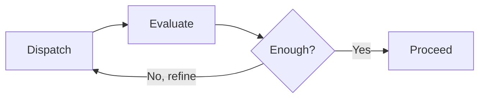

# Iterative Retrieval

Progressively refine context retrieval before and during subagent work, instead of
guessing what context a task needs up front. This addresses the "context problem" in
delegation: a spawned agent rarely knows which files, terms, or patterns it needs until
it has started looking.

This skill complements `context-map` (which scopes the blast radius of a *known* change)
and the `agent-orchestration` rule (which decides *who* does the work). Use it when the
retrieval target itself is uncertain.

## When to Use

- Gathering context for a `Task` subagent that cannot predict which files it needs
- A search returns nothing because the codebase uses unfamiliar terminology
- An agent task fails with "missing context" or balloons with "too much context"
- Designing a multi-step exploration where each step informs the next query
- The user says "find where X is handled" and the first guess at keywords misses

**Do NOT use when:**

- The relevant files are already known — read them directly
- Scope is clear and bounded — use `context-map` instead
- A single `Grep` or `Glob` for an exact symbol answers the question
- Full-codebase onboarding is needed — use `acquire-codebase-knowledge`

## The Problem

Three naive strategies all fail:

| Strategy | Failure mode |
| -------- | ------------ |
| Send everything | Blows the context budget; signal drowns in noise |
| Send nothing | Agent lacks the facts it needs and hallucinates |
| Guess the keywords once | First guess often misses the project's real terminology |

The fix is to treat retrieval as a short, bounded loop rather than a single shot.

## The Loop

Run at most **3 cycles** of dispatch → evaluate → refine, then proceed with the best
context gathered so far. Stopping early is expected — three high-relevance files beat ten
mediocre ones.



### Step 1: Dispatch

Issue a broad first query using the tools available in this toolkit:

- `SemanticSearch` for meaning-based questions ("where do we validate auth tokens?")
- `Grep` for known symbols or exact strings
- `Glob` for file-name patterns
- `codebase-memory` graph tools (`search_graph`, `trace_call_path`) when the question is
  about call chains or structure — far cheaper than repeated grep/read cycles

Start wide. Do not over-specify the first query; its main job is to reveal the codebase's
vocabulary.

### Step 2: Evaluate

Score each candidate for relevance to the task, and — just as important — note what is
still missing:

| Relevance | Meaning | Action |
| --------- | ------- | ------ |
| High (0.8–1.0) | Directly implements the target behavior | Keep |
| Medium (0.5–0.7) | Related types, callers, or patterns | Keep if budget allows |
| Low (0.2–0.4) | Tangential | Drop |
| None (0–0.2) | Irrelevant | Exclude from future cycles |

Explicitly record the **gaps**: "found the handler, still missing where the config is
loaded." Gaps drive the next refinement.

### Step 3: Refine

Update the query from what cycle 1 taught you:

- Add real terminology discovered in high-relevance files (e.g. the codebase says
  "throttle", not "rate limit")
- Target the named gaps directly
- Exclude paths already confirmed irrelevant

### Step 4: Loop or Stop

Stop as soon as either holds:

- You have ≥ 3 high-relevance files and no critical gap remains, **or**
- You have completed 3 cycles — proceed with the best context collected

## Worked Example

```text
Task: "Add rate limiting to the API endpoints"

Cycle 1
  Dispatch:  SemanticSearch "rate limit api endpoint"
  Evaluate:  no strong hits — code uses "throttle" terminology (gap: real term)
  Refine:    switch keywords to "throttle", "middleware"

Cycle 2
  Dispatch:  Grep "throttle"; Glob "**/middleware/*.ts"
  Evaluate:  throttle.ts (0.9), middleware/index.ts (0.7); gap: how routes register it
  Refine:    trace_call_path from router registration

Cycle 3
  Dispatch:  codebase-memory trace_call_path on router setup
  Evaluate:  router-setup.ts (0.8) — registration point found, no gaps
  Stop:      proceed with throttle.ts, middleware/index.ts, router-setup.ts
```

## Handing Context to a Subagent

When delegating via `Task`, pass the *result* of the loop, not the loop itself:

- Provide the high-relevance file paths and a one-line reason for each
- State the terminology the codebase actually uses
- Name any residual gap so the subagent knows what to investigate first

This keeps the subagent's starting context tight and grounded, which is the whole point.

## Best Practices

- **Start broad, narrow fast** — the first cycle is reconnaissance for vocabulary
- **Track gaps explicitly** — a named gap is what makes refinement non-random
- **Exclude confidently** — low-relevance files rarely become relevant later
- **Respect the budget** — see `context-map` scope limits; do not exceed ~20 files
- **Prefer the graph for structure** — `codebase-memory` beats grep/read loops for call
  chains and impact questions

## Related

- `context-map` — scope a known change once retrieval has surfaced the files
- `acquire-codebase-knowledge` — full onboarding when the whole codebase is unknown
- `search-first` — research prior art externally before writing new code
- `agent-orchestration` rule — when and how to delegate the retrieved context
